# IDS706_DE_WK7

For this project I created a My Little Pony themed database to practice SQL queries and build up my own reference guide. I chose this theme because I was watching it recently for relaxing, and I though it was also easier to understand the relationships between different entities. The database tracks information about pony characters, their friendships with each other, the adventures they go on together, and their special talents and abilities. 

I used SQLite to build everything from scratch. I designed the tables, populated them with sample data, and then wrote queries to answer specific questions about the data. Sample data is collected from online, and some with the help of generative AI. This whole project is meant to be a reference I can look back on when I need to remember how to do certain SQL operations, especially the more advanced things like window functions and CTEs that can be quite confusing.

## Database

My database is contained within five related tables that follow good normalization principles. My base table is the ponies table that contains general info for each character including name, type (such as Alicorn, Pegasus, Unicorn, or Earth Pony), element of harmony if it posseses an element, cutie mark, home location, and year of birth. I used INTEGER for the primary and VARCHAR for string columns, taking care to mark important columns like name as NOT NULL to prevent receiving records that are incomplete.

Friendships table is essentially a bridge table that joins ponies to other ponies, keeping track of whom is friends with whom. Friendships both contain two pony IDs (pony_id_1 and pony_id_2), the date the friendship began, and the strength rating, 1 through 10. I utilized foreign keys here to prevent us from being able to add friendships for ponies that do not exist within the database, something that is proper database design.

For the adventures, I established two tables due to the many-to-many relationship. The adventures table contains details regarding each quest or mission, namely the name, location, date, the difficulty level, if it succeeded or not, and how many magical aspects were implemented. The adventure_participants table then associates ponies with adventures, indicating the ponies that took part in each adventure, what role they established (such as Leader or Support), and what score they contributed. The design allows for several ponies to be part of the same adventure and for a single pony to be part of several adventures, and that is precisely what we want.

The talents table is for keeping track of the unique skills each pony possesses. The skills all come with a skill level from 1 to 10 and an acquisition date. Some ponies will have several skills, and others will have only one, and this table design accommodates that adequately with a one-many relationship away from ponies to talents.

## SQL Queries

I wrote 14 different queries to demonstrate various SQL concepts, starting from basic operations and moving up to more complex things. Each query answers a specific question about the pony data and shows how to use different SQL features properly.


### Query 1: Basic SELECT with WHERE and ORDER BY

**Question: Who are all the Alicorn ponies, ordered by birth year?**

This first query is straightforward, just selecting columns from the ponies table where the pony type is Alicorn, then sorting by birth year in ascending order. This query demonstrates the basics of SELECT, FROM, WHERE, and ORDER BY.

```sql
SELECT name, pony_type, element, birth_year
FROM ponies
WHERE pony_type = 'Alicorn'
ORDER BY birth_year ASC;
```
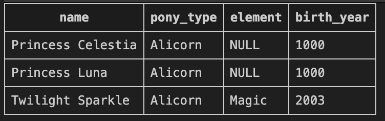

The result shows Princess Celestia and Princess Luna who were born in year 1000, followed by Twilight Sparkle who was born in 2003. 


### Query 2: Aggregate Functions with GROUP BY

**Question: What are the statistics for each pony type?**

For this query I wanted to see some summary statistics grouped by pony type. The query uses COUNT to count how many ponies of each type, AVG to find the average birth year, and MIN to find the oldest birth year in each group. I used ROUND to clean up the average so it doesn't show too many decimal places. GROUP BY is important here because it tells SQL to calculate these aggregates separately for each pony type. 

```sql
SELECT
    pony_type,
    COUNT(*) as total_ponies,
    ROUND(AVG(birth_year), 0) as avg_birth_year,
    MIN(birth_year) as oldest_birth_year
FROM ponies
GROUP BY pony_type
ORDER BY total_ponies DESC;
```
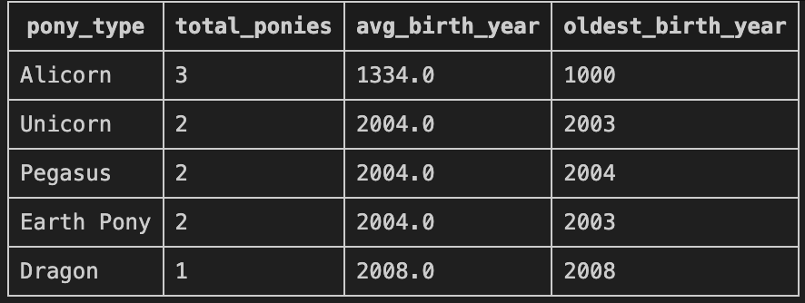

The results show that Alicorns have 3 ponies with an average birth year of 1334.0 (because of the ancient princesses), Unicorns and Pegasus types each have 2 ponies with average birth year of 2004.0, Earth Ponies have 2 with average 2004.0, and Dragon has 1 with birth year 2008.0.


### Query 3: INNER JOIN with HAVING

**Question: Which ponies have more than 1 talent and what's their average skill level?**

This query was a bit tricky because I needed to join the ponies and talents tables together, group by pony, then filter for only those with more than one talent. I have to use HAVING instead of WHERE when I want to filter on aggregate functions like COUNT. So ```HAVING COUNT(t.talent_id) > 1``` only shows ponies who have more than one talent. 

```sql
SELECT
    p.name,
    COUNT(t.talent_id) as talent_count,
    ROUND(AVG(t.skill_level), 1) as avg_skill_level
FROM ponies p
INNER JOIN talents t ON p.pony_id = t.pony_id
GROUP BY p.pony_id, p.name
HAVING COUNT(t.talent_id) > 1
ORDER BY talent_count DESC;
```
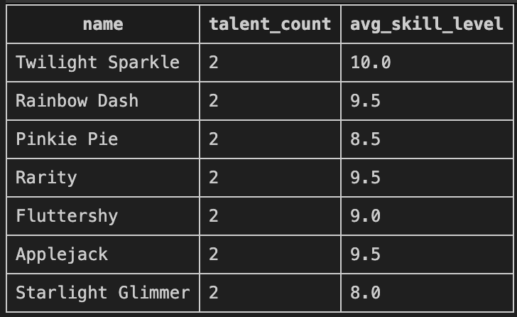

The results show that all seven main characters have exactly 2 talents each. Twilight Sparkle has the highest average skill level at 10.0, followed by Rainbow Dash, Rarity, and Applejack at 9.5, Fluttershy at 9.0, Pinkie Pie at 8.5, and Starlight Glimmer at 8.0.


### Query 4: Multiple INNER JOINs

**Question: What are all the friendship connections between ponies?**

This query requires joining the ponies table to itself through the friendships table, which was a little confusing. Ponies are joined twice, once for pony_id_1 and once for pony_id_2. Aliases like p1 and p2 are used to distinguish them. 

```sql
SELECT
    p1.name as pony_1,
    p2.name as pony_2,
    f.friendship_date,
    f.friendship_strength
FROM friendships f
INNER JOIN ponies p1 ON f.pony_id_1 = p1.pony_id
INNER JOIN ponies p2 ON f.pony_id_2 = p2.pony_id
ORDER BY f.friendship_strength DESC;
```
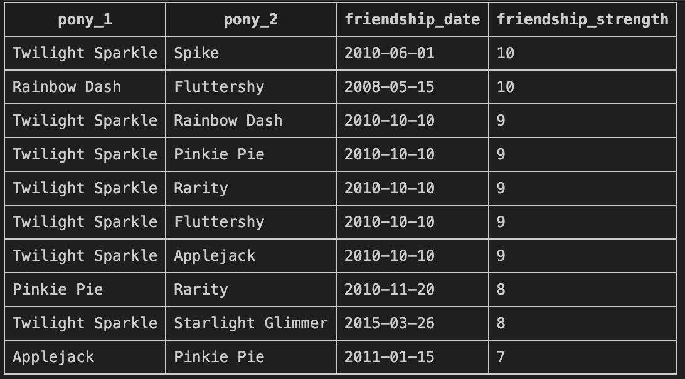

The result shows 10 friendship pairs sorted by strength. Twilight Sparkle and Spike have the strongest friendship at 10, along with Rainbow Dash and Fluttershy also at 10. Most of Twilight's friendships are at strength 9, Pinkie Pie and Rarity have strength 8, Twilight and Starlight Glimmer have strength 8, and Applejack and Pinkie Pie have the lowest recorded friendship strength at 7.


### Query 5: LEFT JOIN to Include All Records

**Question: Show all ponies and their adventure counts, including those who never went on adventures**

The difference between INNER JOIN and LEFT JOIN is important. With LEFT JOIN, all ponies are kept even if they don't have any matching records in adventure_participants. This is why Princess Celestia and Princess Luna show up with 0 adventures, they're in the ponies table but have no adventure participation records. If I used INNER JOIN they wouldn't appear at all. This query also uses COUNT and AVG as aggregate functions while grouping by pony, so we can see how active each character is.

```sql
SELECT
    p.name,
    p.pony_type,
    COUNT(ap.adventure_id) as adventures_count,
    ROUND(AVG(ap.contribution_score), 1) as avg_contribution
FROM ponies p
LEFT JOIN adventure_participants ap ON p.pony_id = ap.pony_id
GROUP BY p.pony_id, p.name, p.pony_type
ORDER BY adventures_count DESC;
```
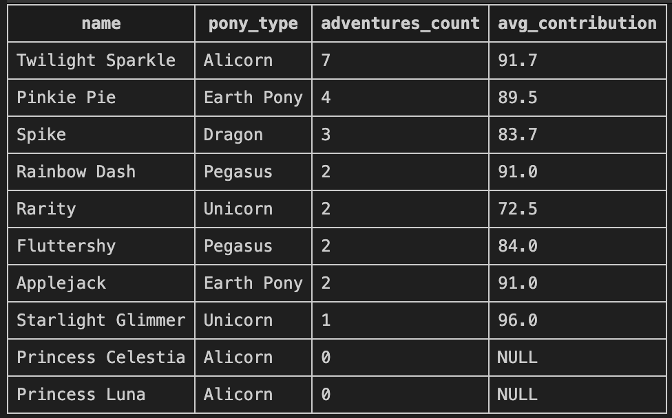

The results show Twilight Sparkle is the most active with 7 adventures and an average contribution of 91.7. Pinkie Pie comes second with 4 adventures at 89.5 average, Spike has 3 adventures with 83.7 average. Rainbow Dash and Applejack both have 2 adventures with 91.0 average each, while Rarity has 2 with only 72.5 average and Fluttershy has 2 with 84.0 average. Starlight Glimmer has just 1 adventure but the highest average contribution at 96.0. Princess Celestia and Princess Luna both show 0 adventures with NULL contribution scores.


### Query 6: Joining Three Tables

**Question: Which adventures did ponies with the "Magic" element participate in?**

Three tables are joined together: adventures, adventure_participants, and ponies. The join goes through adventure_participants as the middle table that connects adventures to ponies. Then I filter with WHERE to only show adventures where the pony's element is Magic, which means only Twilight Sparkle's adventures show up. The query demonstrates how you can chain multiple joins together to connect data across several tables.

```sql
SELECT
    a.adventure_name,
    a.adventure_date,
    p.name as pony_name,
    ap.role,
    ap.contribution_score
FROM adventures a
INNER JOIN adventure_participants ap ON a.adventure_id = ap.adventure_id
INNER JOIN ponies p ON ap.pony_id = p.pony_id
WHERE p.element = 'Magic'
ORDER BY a.adventure_date;
```
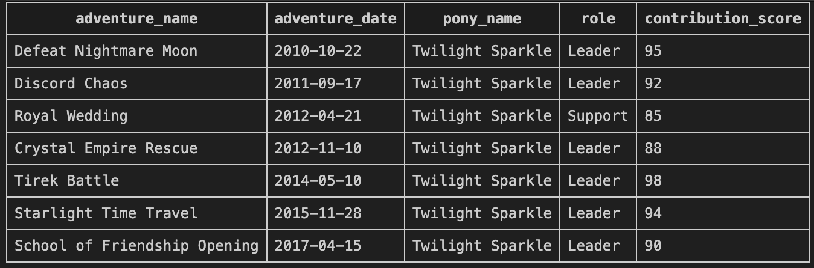

The results show 7 adventures where Twilight Sparkle participated, starting from Defeat Nightmare Moon in 2010-10-22 where she was Leader with score 95, then Discord Chaos in 2011-09-17 as Leader with score 92, Royal Wedding in 2012-04-21 as Support with score 85, Crystal Empire Rescue in 2012-11-10 as Leader with score 88, Tirek Battle in 2014-05-10 as Leader with score 98, Starlight Time Travel in 2015-11-28 as Leader with score 94, and finally School of Friendship Opening in 2017-04-15 as Leader with score 90.


### Query 7: CASE WHEN for Data Transformation

**Question: How can we categorize ponies by age groups and ability types?**

CASE WHEN is useful for creating categories from existing data. In this query I created two new categorizations, one for age groups based on birth year, and one for ability types based on pony type. The CASE statement works like if-else logic, checking each condition in order and returning the first match. So ponies born before 2000 get labeled as Ancient, those between 2000-2003 are Experienced, and so on. Same thing for ability types where I group Alicorns and Unicorns as Magical, Pegasus as Flying, and everything else as Grounded.

```sql
SELECT
    name,
    birth_year,
    CASE
        WHEN birth_year < 2000 THEN 'Ancient'
        WHEN birth_year BETWEEN 2000 AND 2003 THEN 'Experienced'
        WHEN birth_year BETWEEN 2004 AND 2006 THEN 'Young Adult'
        ELSE 'Young'
    END as age_category,
    CASE
        WHEN pony_type IN ('Alicorn', 'Unicorn') THEN 'Magical'
        WHEN pony_type = 'Pegasus' THEN 'Flying'
        ELSE 'Grounded'
    END as ability_type
FROM ponies
ORDER BY birth_year;
```
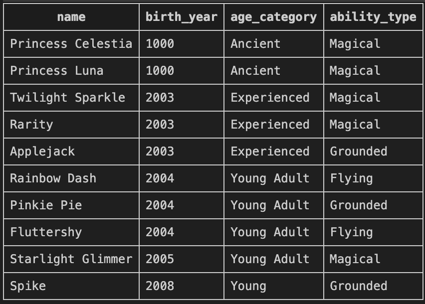

The results show Princess Celestia and Princess Luna are both Ancient and Magical from year 1000. Twilight Sparkle, Rarity, and Applejack are all Experienced from year 2003, with Twilight and Rarity being Magical while Applejack is Grounded. Rainbow Dash, Pinkie Pie, Fluttershy, and Starlight Glimmer are all Young Adults from years 2004-2005, with Rainbow Dash and Fluttershy being Flying types, Pinkie Pie being Grounded, and Starlight Glimmer being Magical. Finally Spike from 2008 is Young and Grounded.


### Query 8: Window Functions for Ranking

**Question: How do ponies rank based on their adventure performance?**

Windows functions were a little confusing. This query uses ROW_NUMBER and RANK to assign rankings to ponies based on their average contribution scores. The difference is that ROW_NUMBER gives each row a unique number even if there are ties, while RANK gives the same rank to tied values and then skips numbers. The OVER clause specifies how to calculate the window function. In this case it is ordering by average contribution score descending. 

```sql
SELECT
    p.name,
    COUNT(ap.adventure_id) as total_adventures,
    ROUND(AVG(ap.contribution_score), 1) as avg_contribution,
    ROW_NUMBER() OVER (ORDER BY AVG(ap.contribution_score) DESC) as row_num,
    RANK() OVER (ORDER BY AVG(ap.contribution_score) DESC) as rank_position
FROM ponies p
INNER JOIN adventure_participants ap ON p.pony_id = ap.pony_id
GROUP BY p.pony_id, p.name
ORDER BY avg_contribution DESC;
```
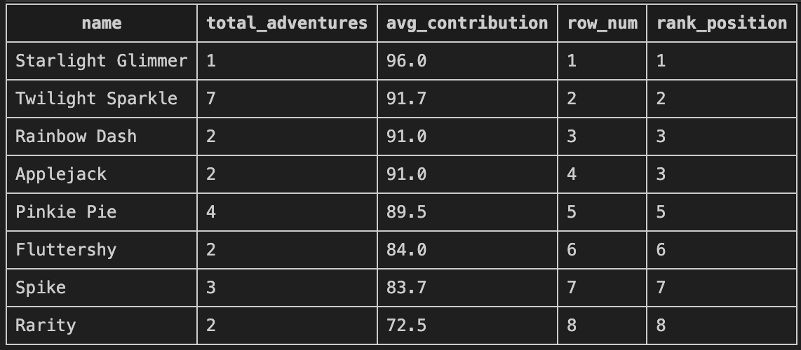

Starlight Glimmer ranks first with the highest average contribution of 96.0 from just 1 adventure, getting row_num 1 and rank_position 1. Twilight Sparkle is second with 7 adventures and 91.7 average, row_num 2 and rank 2. Then Rainbow Dash and Applejack are tied at 91.0 average with 2 adventures each, they get row_num 3 and 4 but both have rank_position 3 because they're tied. Pinkie Pie comes next with 4 adventures and 89.5 average at row_num 5 and rank 5. Fluttershy has 2 adventures with 84.0 average at position 6, Spike has 3 adventures with 83.7 average at position 7, and Rarity has 2 adventures with the lowest 72.5 average at position 8.


### Query 9: PARTITION BY for Grouped Calculations

**Question: What's the success rate for adventures at each difficulty level?**

PARTITION BY is like GROUP BY but for window functions. This query calculates the success rate separately for each difficulty level by using PARTITION BY difficulty_level in the OVER clause. For each row, it counts how many adventures are in that difficulty group, sums up the successes, and calculates the percentage. These calculations happen per row while still showing individual adventure details. 

```sql
SELECT
    difficulty_level,
    adventure_name,
    success,
    COUNT(*) OVER (PARTITION BY difficulty_level) as total_in_difficulty,
    ROUND(100.0 * SUM(CASE WHEN success THEN 1 ELSE 0 END)
        OVER (PARTITION BY difficulty_level) /
        COUNT(*) OVER (PARTITION BY difficulty_level), 1) as success_rate
FROM adventures
ORDER BY difficulty_level, adventure_date;
```
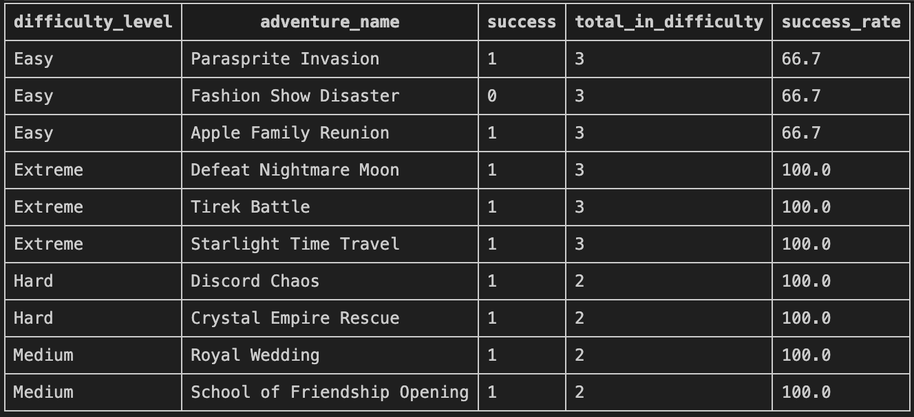

The results show Easy difficulty has 3 total adventures with 66.7% success rate because Fashion Show Disaster failed while Parasprite Invasion and Apple Family Reunion succeeded. Extreme difficulty has 3 adventures with 100.0% success rate for Defeat Nightmare Moon, Tirek Battle, and Starlight Time Travel all succeeding. Hard difficulty has 2 adventures both successful giving 100.0% for Discord Chaos and Crystal Empire Rescue. Medium difficulty also has 2 adventures both successful at 100.0% for Royal Wedding and School of Friendship Opening.

### Query 10: Common Table Expressions (CTEs)

**Question: Which ponies have above-average talent skill levels?**

CTEs using WITH make complex queries much easier to read and understand. Here I first create a CTE called talent_averages that calculates the average skill level for each pony, then in the main query I filter for only those ponies whose average is above the overall average. 

```sql
WITH talent_averages AS (
    SELECT
        p.pony_id,
        p.name,
        AVG(t.skill_level) as avg_skill
    FROM ponies p
    INNER JOIN talents t ON p.pony_id = t.pony_id
    GROUP BY p.pony_id, p.name
)
SELECT
    name,
    ROUND(avg_skill, 1) as avg_talent_level
FROM talent_averages
WHERE avg_skill > (SELECT AVG(skill_level) FROM talents)
ORDER BY avg_skill DESC;
```
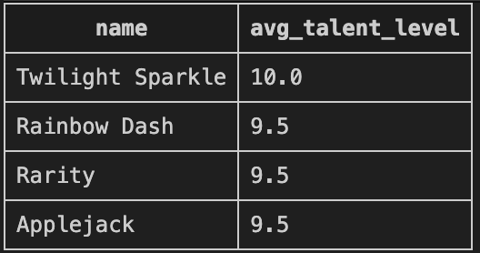

The result shows only 4 ponies have above-average talent skill levels. Twilight Sparkle has a perfect 10.0 average, while Rainbow Dash, Rarity, and Applejack are all tied at 9.5 averages.


### Query 11: Multiple CTEs

**Question: What are the comprehensive friendship and adventure statistics for each pony?**

You can use multiple CTEs in one query by separating them with commas. This query creates two CTEs, one for friendship stats and one for adventure stats. Then it joins them both to the ponies table. Using COALESCE is important here because if a pony has no friendships or adventures, the LEFT JOIN returns NULL and COALESCE converts that to 0 for cleaner output. 

```sql
WITH friendship_stats AS (
    SELECT
        pony_id_1 as pony_id,
        COUNT(*) as friend_count
    FROM friendships
    GROUP BY pony_id_1
),
adventure_stats AS (
    SELECT
        pony_id,
        COUNT(DISTINCT adventure_id) as adventure_count
    FROM adventure_participants
    GROUP BY pony_id
)
SELECT
    p.name,
    COALESCE(fs.friend_count, 0) as friends,
    COALESCE(as2.adventure_count, 0) as adventures
FROM ponies p
LEFT JOIN friendship_stats fs ON p.pony_id = fs.pony_id
LEFT JOIN adventure_stats as2 ON p.pony_id = as2.pony_id
ORDER BY friends DESC, adventures DESC;
```
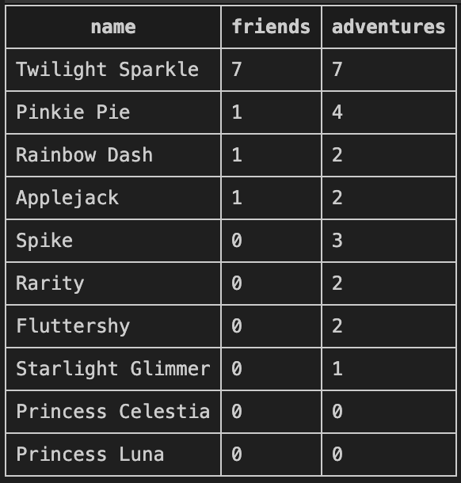

The results show Twilight Sparkle is the most social with 7 friends and has done 7 adventures. Pinkie Pie has 1 friend and 4 adventures. Rainbow Dash and Applejack both have 1 friend and 2 adventures each. Spike has 0 friends but 3 adventures. Rarity and Fluttershy both have 0 friends and 2 adventures. Starlight Glimmer has 0 friends and 1 adventure. Princess Celestia and Princess Luna both have no recorded friendships or adventures showing 0 for both.

### Query 12: String Functions (Self-Explored)

**Question: How can we format and manipulate pony profile information?**

UPPER converts text to uppercase, the || operator concatenates strings together, LENGTH returns the number of characters, SUBSTR extracts a substring starting at a position for a certain length, and LIKE does pattern matching with wildcards. This query formats pony names in different ways and shows how you can manipulate text data. For example it creates a full title like "Twilight Sparkle the Alicorn" by concatenating the name with the pony type.

```sql
SELECT
    UPPER(name) as name_caps,
    name || ' the ' || pony_type as full_title,
    LENGTH(cutie_mark) as cutie_mark_length,
    SUBSTR(home_location, 1, 4) as location_code
FROM ponies
WHERE name LIKE '%Twilight%' OR name LIKE '%Rainbow%';
```
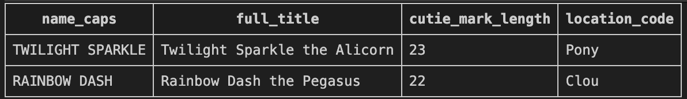

The results show two ponies matching the pattern. TWILIGHT SPARKLE in caps with full title "Twilight Sparkle the Alicorn", cutie mark length of 23 characters, and location code "Pony" from Ponyville. RAINBOW DASH in caps with full title "Rainbow Dash the Pegasus", cutie mark length of 22 characters, and location code "Clou" from Cloudsdale.


### Query 13: UNION Operation (Self-Explored)

**Question: Who are the extreme adventurers vs casual adventurers?**

UNION combines the results of two separate SELECT statements into one result set, removing duplicates automatically. This query finds ponies who went on Extreme difficulty adventures and labels them as Extreme Adventurers, then unions it with ponies who went on Easy adventures labeled as Casual Adventurers. 

```sql
SELECT DISTINCT p.name, 'Extreme Adventurer' as category
FROM ponies p
INNER JOIN adventure_participants ap ON p.pony_id = ap.pony_id
INNER JOIN adventures a ON ap.adventure_id = a.adventure_id
WHERE a.difficulty_level = 'Extreme'

UNION

SELECT DISTINCT p.name, 'Casual Adventurer' as category
FROM ponies p
INNER JOIN adventure_participants ap ON p.pony_id = ap.pony_id
INNER JOIN adventures a ON ap.adventure_id = a.adventure_id
WHERE a.difficulty_level = 'Easy'
ORDER BY category, name;
```
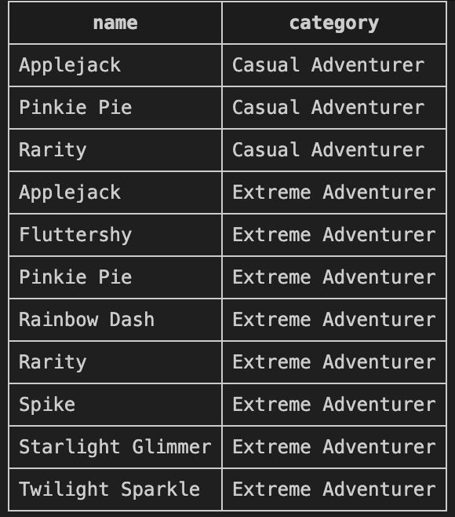

The results show 11 total rows. Under Casual Adventurer category are Applejack, Pinkie Pie, and Rarity who participated in Easy difficulty adventures. Under Extreme Adventurer category are Applejack, Fluttershy, Pinkie Pie, Rainbow Dash, Rarity, Spike, Starlight Glimmer, and Twilight Sparkle who participated in Extreme difficulty adventures. Notice that Applejack, Pinkie Pie, and Rarity appear in both categories because they did both easy and extreme adventures.

### Query 14: COALESCE for NULL Handling (Self-Explored)

**Question: What's a complete report of all ponies with their elements and adventure participation?**

COALESCE is really useful for handling NULL values by providing a default value if the first argument is NULL. In this query, if a pony doesn't have an element assigned (like Spike or Starlight Glimmer), COALESCE replaces the NULL with the text 'No Element'. Same thing for adventure count. If the COUNT returns NULL because of the LEFT JOIN, it gets replaced with 0. This makes the output much cleaner and easier to read compared to having NULLs scattered throughout the results.

```sql
SELECT
    p.name,
    COALESCE(p.element, 'No Element') as element,
    COALESCE(COUNT(DISTINCT ap.adventure_id), 0) as adventure_count
FROM ponies p
LEFT JOIN adventure_participants ap ON p.pony_id = ap.pony_id
GROUP BY p.pony_id, p.name, p.element
ORDER BY adventure_count DESC;
```
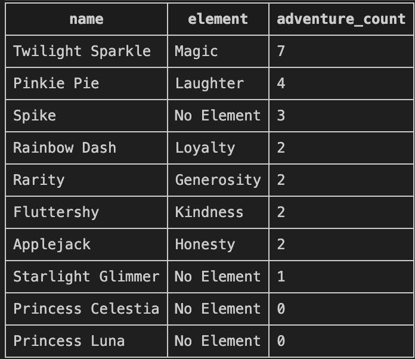

The results show all 10 ponies sorted by adventure count. Twilight Sparkle has element Magic with 7 adventures. Pinkie Pie has Laughter with 4 adventures. Spike has No Element with 3 adventures. Rainbow Dash has Loyalty with 2, Rarity has Generosity with 2, Fluttershy has Kindness with 2, and Applejack has Honesty with 2 adventures. Starlight Glimmer has No Element with 1 adventure. Princess Celestia and Princess Luna both have No Element with 0 adventures.

## Reflection

For this assignment I became a lot more familiar with SQL syntax and how to break down complicated queries step for step. The challenging aspects were certainly window functions and the determination of when to HAVING or WHERE. I always got errors at first when I attempted to filter aggregate functions with WHERE, then I figured that HAVING is needed for that. And the PARTITION BY concept took me some time to grasp, but when I figured it is similar to defining separate groups for window logic it all became a lot clearer.

JOINs are crucial and I played around with the different kinds. LEFT JOIN and INNER JOIN are the kinds that can either make or break your output, especially if you want to incorporate records that do not have matches. I also discovered that if you are joining the same table twice, then table aliases are needed so that you can tell what is what, for instance, I joined ponies with itself for the friendships query.